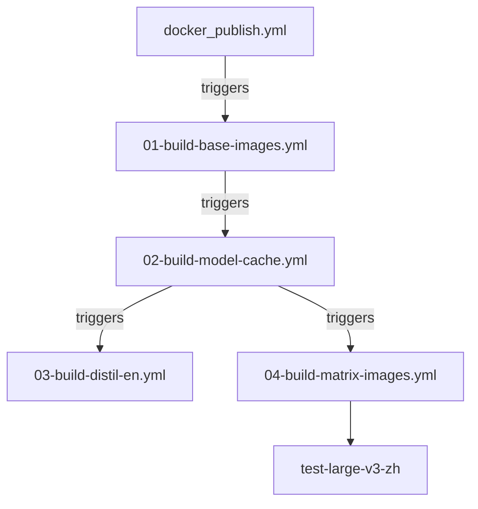

# Docker Workflow Architecture

This document describes the refactored CI/CD workflow architecture for building Docker images in the docker-whisperX project.

## Overview

The original single `docker_publish.yml` workflow has been split into 5 specialized workflow files to improve maintainability, parallel processing efficiency, and fault isolation for building 175+ Docker images (10GB each).

## Workflow Chain

## Workflow Files

### 1. `docker_publish.yml` (Entry Point)
- **Purpose**: Main trigger and coordination
- **Triggers**: Push to master, tags, manual dispatch
- **Actions**: Logs build chain initiation info
- **Next**: Triggers `01-build-base-images.yml`

### 2. `01-build-base-images.yml`
- **Purpose**: Build base images
- **Triggered by**: `docker_publish.yml`
- **Jobs**:
  - `docker-ubi-no_model`: Red Hat UBI-based base image
  - `docker-no_model`: Standard base image
- **Outputs**: Base image digests for downstream workflows
- **Next**: Triggers `02-build-model-cache.yml`

### 3. `02-build-model-cache.yml`
- **Purpose**: Build Whisper model cache images
- **Triggered by**: `01-build-base-images.yml`
- **Jobs**:
  - `docker-cache`: Matrix build for 6 models (tiny, base, small, medium, large-v3, distil-large-v3)
- **Dependencies**: Uses base images from previous workflow
- **Next**: Triggers both `03-build-distil-en.yml` and `04-build-matrix-images.yml` in parallel

### 4. `03-build-distil-en.yml`
- **Purpose**: Build distil-large-v3-en specialized image
- **Triggered by**: `02-build-model-cache.yml`
- **Jobs**:
  - `docker-distil-large-v3-en`: English-optimized distil model
- **Parallel with**: `04-build-matrix-images.yml`

### 5. `04-build-matrix-images.yml`
- **Purpose**: Build full image matrix and run tests
- **Triggered by**: `02-build-model-cache.yml`
- **Jobs**:
  - `docker`: Matrix build (37 languages × 5 models = 185 builds)
  - `test-large-v3-zh`: Test Chinese image functionality
- **Parallel with**: `03-build-distil-en.yml`

## Key Features

### Workflow Chaining
- Uses `workflow_run` events for dependency management
- Conditional execution based on previous workflow success
- Proper error handling and failure isolation

### Image Reference Management
- Base images are referenced by commit SHA tags
- Consistent naming convention across workflows
- Proper digest passing between dependent workflows

### Resource Optimization
- Parallel execution where possible (distil-en + matrix builds)
- Maintained Docker layer caching strategy
- Free disk space management for large images

### Error Handling
- `fail-fast: false` for matrix builds to continue on partial failures
- Conditional execution (`if: ${{ github.event.workflow_run.conclusion == 'success' }}`)
- Isolated failure domains per workflow

## Benefits

### Maintainability
- **Modular Design**: Each workflow focuses on specific build stages
- **Independent Debugging**: Can test and fix specific stages in isolation
- **Code Reuse**: Shared logic through reusable actions

### Performance
- **Staged Parallelism**: distil-en and matrix builds run in parallel
- **Resource Optimization**: Avoid overloading GitHub runners
- **Fault Isolation**: Stage failures don't immediately impact other independent stages

### Monitoring
- **Granular Status Tracking**: Clear visibility into each build stage
- **Selective Re-runs**: Can re-execute only failed specific stages
- **Log Separation**: Easier to find and analyze stage-specific build logs

### CI/CD Management
- **Progressive Deployment**: Can gradually test and deploy build process changes
- **Version Control**: Each workflow can be independently versioned and rolled back
- **Strategy Flexibility**: Can adopt different execution strategies for different build stages

## Migration Notes

### From Original Workflow
- All job functionality preserved
- Same Docker build arguments and caching strategies
- Same test procedures and quality gates
- Same output artifacts and attestations

### Breaking Changes
- Workflow names changed (affects status badges and external references)
- Build timing may change due to sequential workflow execution
- Different workflow run IDs for different stages

### Rollback Strategy
- Original workflow backed up as `docker_publish.yml.backup`
- Can be restored by renaming backup file
- All new workflow files can be safely deleted for rollback

## Monitoring and Troubleshooting

### Status Monitoring
- Check each workflow individually in GitHub Actions
- Use workflow_run events to trace dependencies
- Monitor build times and resource usage per stage

### Common Issues
- **Image Reference Failures**: Check SHA tag generation and image availability
- **Workflow Chaining**: Verify `workflow_run` triggers are correctly configured
- **Permission Issues**: Ensure all workflows have proper GITHUB_TOKEN permissions

### Debugging
- Each workflow can be manually triggered for testing
- Use workflow_dispatch for individual workflow debugging
- Check workflow_run event payloads for data passing issues
